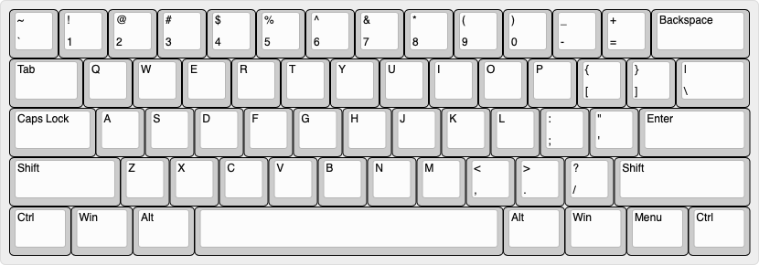
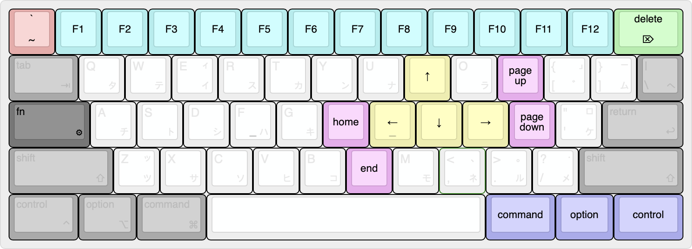
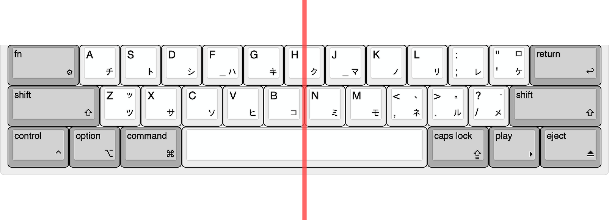
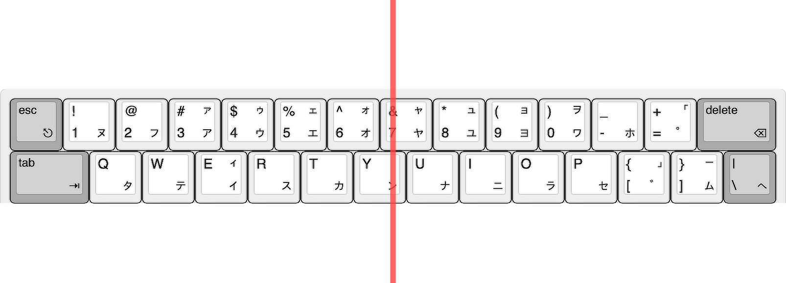
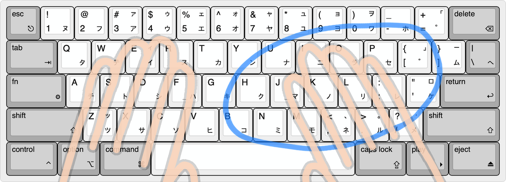

  [이 포스트 영어로 보기](../)

### 미적으로 완벽한 키보드의 필요성
키보드는 여러 레이아웃이 존재한다. 당신은 어떤 레이아웃의 키보드를 쓰고 있는가? 키보드에 별로 관심이 없다면 풀배열의 키보드를 사용하고 있을 것이다.  
풀배열 외에도 텐키를 제거한 텐키리스, 텐키리스에서 펑션키를 제거한 65%, 거기에 방향키까지 제거한 60%, 정말 최소한의 키만 남겨 놓은 40% 등 아주 다양한 레이아웃들이 있다. 이 레이아웃들을 나열해 놓고 보면, 키의 수가 적어질 수록 미관이 예뻐지고 동시에 불편하다는 것을 깨닫게 된다. 키의 수가 적으면, 없는 키는 복수의 키 조합으로 대체해야하기 때문이다. 물론 이것은 키보드만 사용했을 때의 얘기이고, 마우스 사용을 겸했을 때라면, 풀배열은 모든 키가 있음에도 오히려 불편할 수 있다.  
나는 이 디자인과 사용성의 가장 적절한 접접을 60% 키보드라고 생각한다. 여기에서 60% 레이아웃을 한번 보자.

역시 있을 건 다 있으면서 예쁘다. 확실히 가장 마음에 드는 레이아웃임에 틀림없다.  
그럼 이게 가장 완벽한 레이아웃일까? 그렇다기엔 약간의 불만이 생긴다. 왼쪽과 오른쪽의 쉬프트의 길이가 다르다. 굳이 다르게 디자인한 이유가 있을까? 아무리 생각해도 이유를 알 수가 없다... 그리고 가장 아랫줄의 스페이스바 좌우에 있는 키의 수도 다르다.  
이게 스탠다드 규격의 배열인데, 보다보니 이것을 좌우대칭으로 만들 수 있을 것 같다는 생각이 들었다. 바로 디자인해보기로 했다. 구글링으로 keyboard-layout-editor.com라는 곳을 찾게 되어 손쉽게 레아아웃 디자인을 할 수 있었다.

##### 1. 맥용 레이아웃

##### 2. 윈도우용 레이아웃

##### 3. 나한테 맞춘 커스텀 레이아웃

아래는 Fn키를 눌렀을 때의 조합키

레이아웃 디자인 후 너무너무 만족스럽고 아름다움 그 자체라서 꼭 이 키보드를 만들고 싶어졌다. 일단 완벽한 좌우대칭에서 오는 아름다움. 그냥 보고만 있어도 가슴이 웅장해지는 느낌이다. 키캡에 카타카나를 새긴 것은 그냥 내가 레트로 감성을 좋아하기 때문으로, 키캡까지 제작하지 않는다면 저대로의 키보드를 만들 수는 없긴하다...  
그럼 디테일에 대해 자세히 알아보자.

##### 완벽히 아름다운 대칭이 맞을까

우선 아래쪽 세 줄을 보자. 정중앙의 빨간 라인을 기준으로 완전한 좌우대칭이다.

그리고 위쪽 두 줄은 정중앙의 라인을 기준으로 첫번째 줄과 두번째 줄이 대각대칭이다.

##### 키의 배치 이유
먼저 눈에 띄는 것은 캡스락키의 자리에 펑션키가 있다는 것 일텐데, 캡스락키는 모든 모디파이어 키 중에 **가장 누르기 편한 위치**에 있다. 그러나 생각해보자. 여러분은 캡스락키를 얼마나 자주 사용하는가? 분명, 사용한 적이 손에 꼽을 정도로 적을 것이다. 주로 한글을 사용하는 유저라면 더더욱. 사용빈도가 거의 바닥에 가까운 키를 가장 좋은 위치에 두기에는 자리가 너무 아깝다. 그러므로 키를 조합해서 써야하는 60% 키보드에서는 펑션키를 이 곳에 놓는 것이 매우 효율적이다. 내 커스텀 레이아웃에서는 캡스락키를 오른쪽 아래로(실제로는 카라비너로 키매핑해서 언어 전환키로 쓸 예정이긴 함), 나머지 레이아웃에서는 `Fn + Tab`으로 사용하는 것이 좋다고 생각해 이렇게 배치하였다.  

다음으로 방향키와 홈,엔드, 페이지 업/다운 키의 배치인데, 키보드에 손을 올리고 굽힌 손가락을 펴보도록 하자. 그럼 아래 그림과 같은 모양이 될 것이다.

따라서 손 자체는 움직이지 않고 손가락의 움직임만으로 편하게 누를 수 있는 키의 범위는 파란 동그라미 안쪽 정도가 된다. 왼손은 펑션키를 누르고 오른손은 제자리에서 손가락만 움직여 방향키, 홈, 엔드, 페이지 업/다운 키를 조작할 수 있게 되는 것이다.

>  [ 2020. 12. 25. 내용 추가 ]
>> 유투브 등을 보고 있을 때는 키보드에서 손을 떼고 있는 경우가 많다. 이 때는 한 손만으로 방향키를 통해 앞으로, 뒤로, 볼륨 등을 조작하게 되는데, 위의 방법으로는 왼손으로 펑션키를 누르면서 오른손으로 방향키를 조작하는 수 밖에는 없다. 따라서 펑션과 WASD 조합 또한 추가해서 왼손 한 손만으로 방향키 조작도 가능하게 하는 것이 좋을 것 같다.

#### 실물 키보드 제작 계획
지금 디자인한 레이아웃은 아무리 찾아봐도 국내외에서 판매제품도 없고 만들고자 시도한 사람도 없다. 따라서 직접 PCB(기판), 케이스, 보강판을 설계하고 제작해야한다.  
물론 설계할 줄을 모르기 때문에 국내에 존재하는 공방을 찾아서 의뢰해 보았다. PCB의 설계 의뢰의 경우, 핀당 1000원이 보통이기 때문에 5핀짜리 스위치 100개면 아무리 적게 잡아도 50만원 이상이 나온다는 답변이 돌아왔다. 그 말대로라면 나는 체리 MX 스위치를 사용할 예정이고 LED도 필요없기 때문에 키당 2핀에 60키이기 때문에 12만원에 가능하다는 견적이 나오지만 그렇게는 의뢰를 받지 않을 것 같다... 케이스나 보강판은 플라스틱이나 알루미늄으로 하고 싶지만, 단 두개만 생산하려면 단가가 얼마나 비쌀지 모르기 때문에 그냥 설계도 생산도 간단한, 게다가 가격도 저렴한 아크릴로 만들어 볼까싶다.