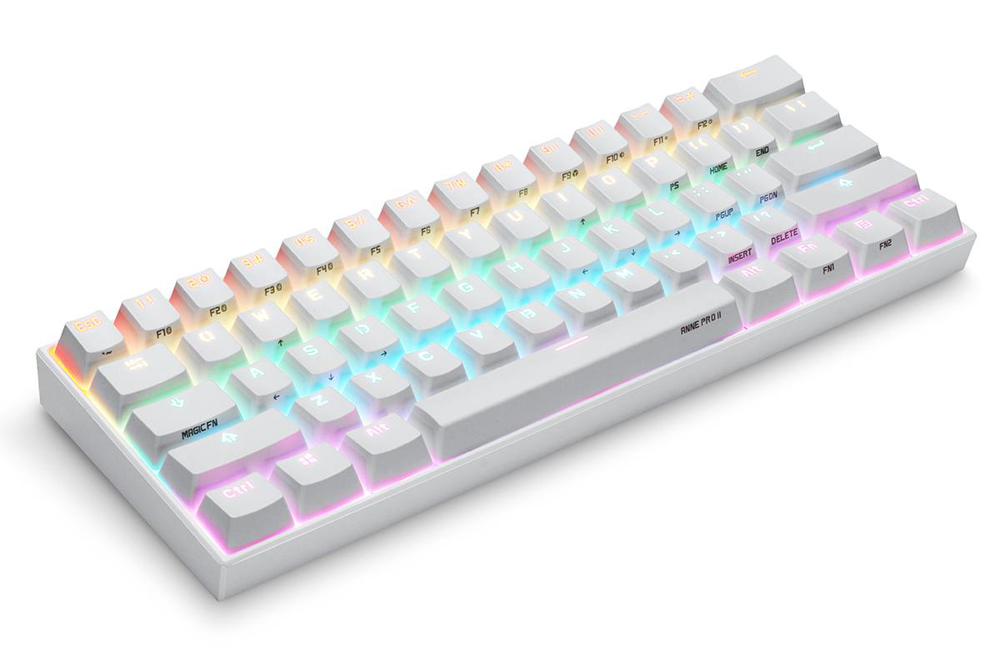

#### 두번째 키보드로 SK64S를 고른 이유
메인 키보드로 W200을 고른 이유는 텐키리스 배열로 마우스까지의 거리를 줄이기 위함이 가장 컸었다. 일단 텐키르 제외한 모든키가 있는 키보드를 든든하게 구비해 놓았으니 작고 예쁜 키보드를 새로 들일 차례가 되었다.  
서브 키보드로 생각하고 있었던 배열은 60%나 65%인데, 이 경우 숫자키 위와 엔터키 오른쪽의 모든 키들이 없다. 60%와 65%의 차이점이라면 60%는 방향키가 없는 반면에, 65%는 60%배열에서 오른쪽 모디열에 방향키를 우겨넣은 모양이다.  
일단은 방향키가 아예없는 건 불편할 것 같다고 생각해서 ~~망할 엑셀때문에~~ 65% 배열인 SKYLOONG(구 GEEK)의 SK64S를 먼저 사게 되었다.

가장 대표적인 60% 배열 키보드 Anne Pro 2

#### SK64S의 장점
---
##### 1. 광축 스위치
광축 스위치의 특징은 그 원리에 의해 방수가 가능하고 솔더링(납땜)이 필요없으며 반응속도가 빠르다~~(이론상 빠르긴한데 사람이 체감할 정도는 아님)~~는 것이다.  
SK64S는 게이트론사의 광축 스위치를 사용하고 있다. 그래서 광축 스위치의 장점이 그대로 적용된다고 할 수 있겠다. 
##### 2. XDA키캡
기본 키캡이 OEM이 아닌 XDA로 낮고 플랫한 키캡이라 예쁘다 색상이 4가지가 있는데 4가지 전부 예쁨.
##### 3. 맥용 모디 키캡
컨트롤, 윈도우, 알트키를 컨트롤, 커맨드, 옵션으로 바꿀 수 있는 키캡을 기본으로 제공한다.
##### 4. 해피해킹과 같은 가로사이즈
이건 팜레스트를 사용하는 유저에게만 장점이라고 할 수 있을 것 같다. 키캡의 경우 표준규격이 정해져 있어 모두 규격을 따르지만, 같은 60% 배열이라고 해도 베젤의 크기가 다르기 때문에 키보드마다 가로 사이즈가 다르다.  
나같은 경우 맞춤 팜레스트를 사용하는데, SK64S의 경우 가로가 실측 294mm이다. 딱맞아 떨어지는 팜레스트를 원했고, 사이즈를 가로 294mm로 주문제작하였다. 그리고 나는 언젠가 해피해킹을 살 생각이 있기때문에, 따로 해피해킹에 맞춘 팜레스트를 새로 주문하지 않아도 된다는 것이 장점이 되겠다.

#### SK64S의 단점
---
##### 1. 하단 열 배치
SK64S는 우측 모디열에 방향키를 우겨넣었기 때문에 우측 쉬프트키가 일반키의 사이즈와 같다. 그러나 본인이 우측 쉬프트를 누른다고 생각하고 손가락을 올려보자. 아마 쉬프트의 가장 좌측을 누를 것이다. 그러므로 쉬프트가 짧아도 전혀 문제가 없다고 생각하였다. 그러나 SK64S를 구매하고 생각이 바뀌었다. 그러나 문제는 쉬프트의 길이가 아니었다. 쉬프트의 위치이다. 따로 설명 없이 아래 사진을 보면 바로 이해가 갈 것이다.

위: SK64S / 아래: SK61

우측에 버튼 3개를 넣기 위해 왼쪽 쉬프트를 길이를 줄이고 각 키들을 왼쪽으로 조금씩 당긴 모습이다.

이게 생각보다 불편한게, 오른손은 괜찮은데 왼손 타이핑에서 쉬프트를 누르면 쉬프트와 방향키가 같이 눌리는 경우가 많다. 그리고 쉼표, 마침표, 물음표가 오타가 굉장히 잦다. 손이 기억하는 위치랑 미묘하게 달라서 그런듯.

##### 2. 광축 스위치
SK64S를 광축 스위치는 구매하기 전까지는 광축스위치는 단점보다 장점이 훨씬큰 것 같은데 '왜 많이 사용하지 않을까? 아직 과도기인 걸까?' 라고 생각했다. 그러나 광축 스위치의 작동방식에 대해 더 깊게 알아본 결과 그 이유를 알게되었다. 우선 광축스위치의 경우 솔더링이 필요없다. 이게 왜 가능할까? 광축 스위치는 적외선 센서를 가림으로 입력을 인식하는데, 문제는 이 센서가 스위치 내부가 아니라 PCB기판에 있다... 나는 이 센서가 스위치 내부에 있어서 고장난 스위치만 갈아끼우는 식으로 오래 쓰려고 했던건데 나중에 알고보니 센서가 하나만 고장나도 스위치를 갈아서 해결이 안되므로 그냥 키보드를 새로 사야한다. 물론 수명이 5-6년정도로 기계식 스위치의 수명과 비슷하므로, 아마 센서가 맛이 가기 전에 이미 다른 키보드가 갖고싶어서 샀을 확률이 높긴하다.

#### 그래서 결국 어떻게 했는가?
결론은 SK64S를 반품처리하였다. 광축 스위치의 단점을 알아버려서는 아니고, 하단 열의 배열때문이다. 그리고 새로 SK61S를 주문하였다. 이것을 센서가 맛탱이가 갈 때까지 쓸 예정이고, 지금 만들고 싶은 배열의 키보드가 있어서(아무리 찾아봐도 세상에 존재하지 않는 배열임) 이 키보드를 제작해보려고 한다. 다음으로는 이 커스텀 키보드에 대해 포스팅하게 될 것같다.