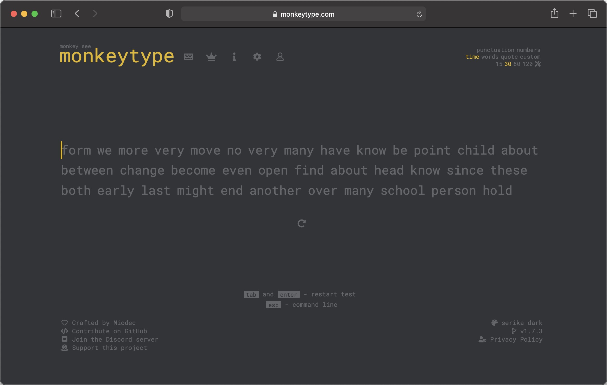
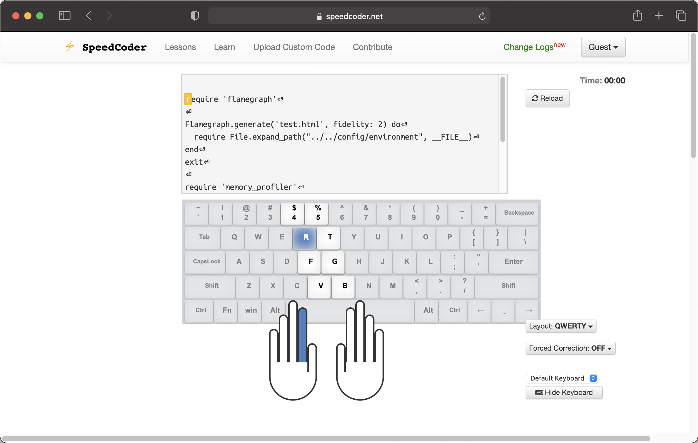
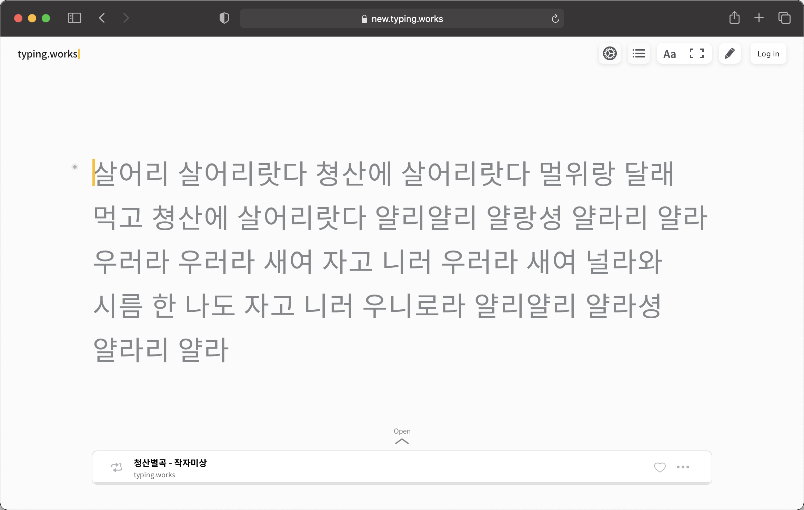
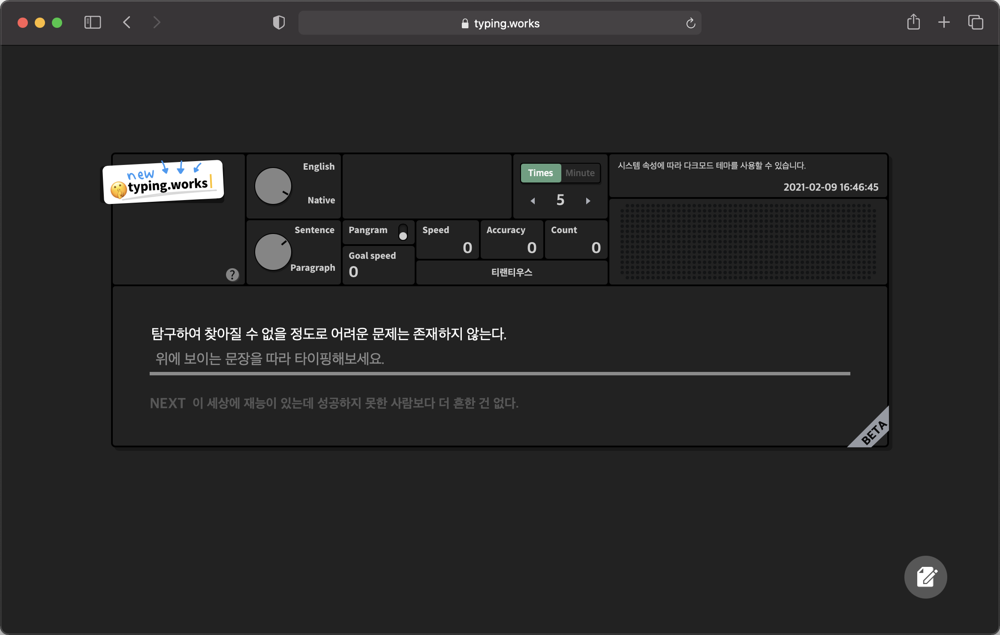

### monkeytype
---
The best typing website. A minimalistic typing test.

<a href="https://monkeytype.com" target="_blank">https://monkeytype.com</a>

### SpeedCoder
---
Online typing practice for Programmers.

<a href="https://www.speedcoder.net" target="_blank">https://www.speedcoder.net</a>

### new.typing.works
---
The best typing website for Korean. But this is a pretty much copy of monkeytype. 

<a href="https://new.typing.works" target="_blank">https://new.typing.works</a>

### typing.works
---
It is a beta version of typing.works. I think this has the identity of typing.works more. 

<a href="https://typing.works" target="_blank">https://typing.works</a>

