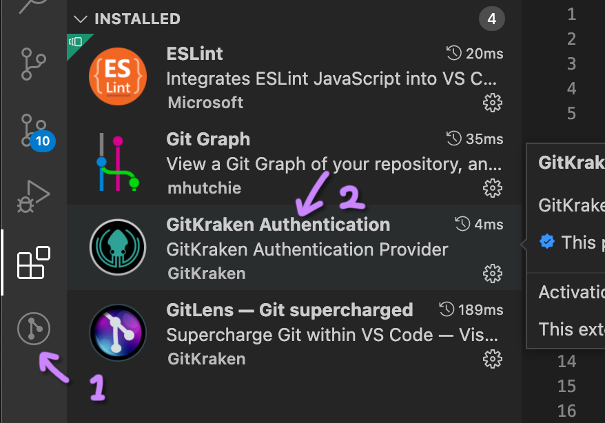
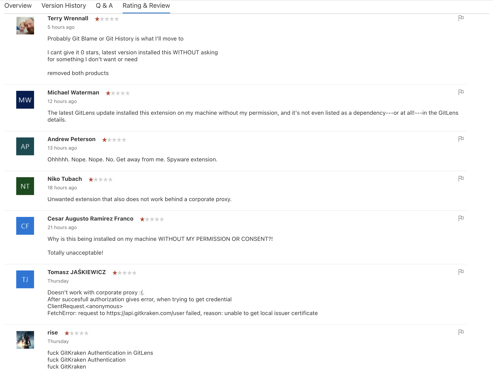
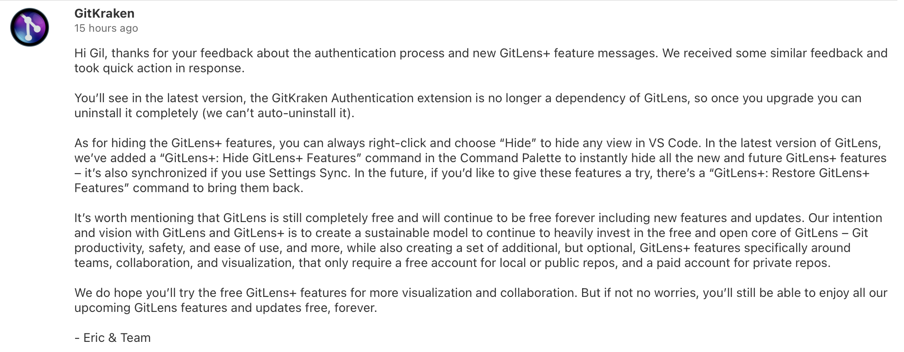

#### Today I updated Gitlens.
Then, an icon appeared in the activity bar(\*1). I didn't like it very much, but I passed.  
However, I found that something I had never installed(\*2). Since the publisher is GitKraken, it was probably installed due to an update in GitLens.

#### I immediately uninstalled this.
And returned the version of GitLens to 11.7.0.  
I went straight to the marketplace and checked everyone's reactions. Everyone was angry.

Below is GitKraken's comment I found among GitLens reviews:

