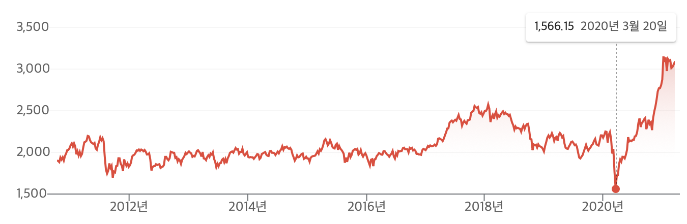

1. 작년, 코로나로 코스피가 미친듯이 폭락
2. 폭락을 막고자 공매도 금지 조치 때림
3. 개미 주식 붐이 일어남
4. 코스피 다시 상승(공매도 금지 조치로부터 지금까지 거의 2배 오름)
5. 지금의 공매도 금지 조치는 '역대 최장기간'임
6. 사상 최초로 코스피 3000 돌파
7. 5월 3일에 공매도 금지 조치 해제 예정
8. 공매도 재개되면 최근 유입 개미들은 멘탈 못잡고 패닉셀할 가능성 매우 높음

8줄도 읽기 싫으면 그냥 그래프로 보면 바로 느낌 옴.
